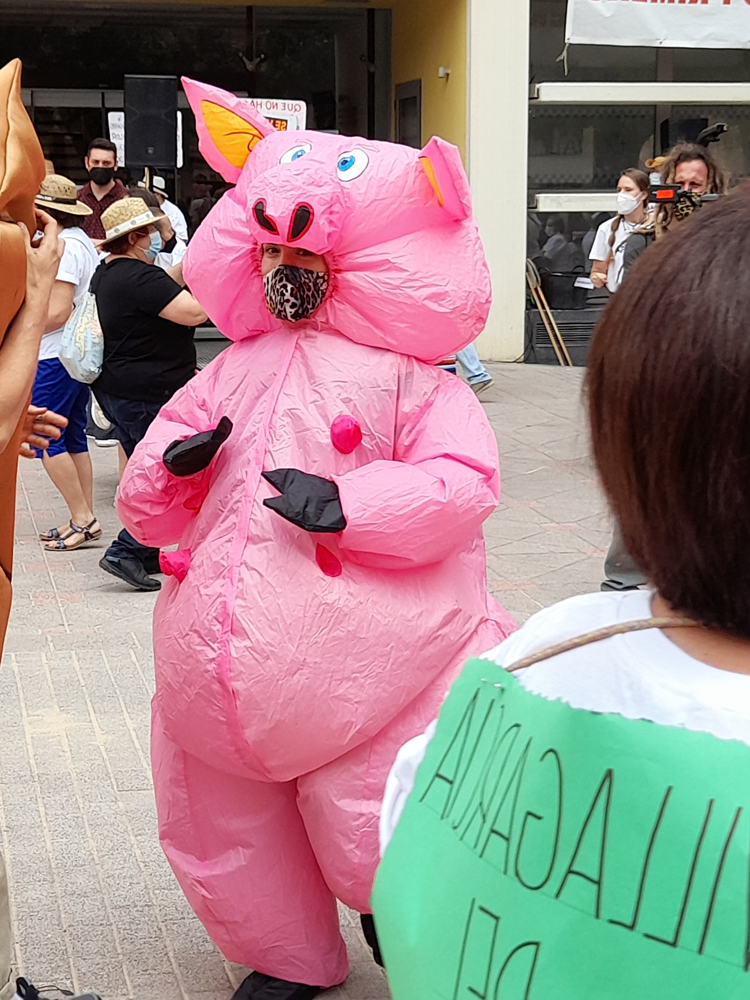

# **¡Bienvenido/a!**

Esta página web es una forma de documentar el código en el que se base el analisis cuantitativo de mi
proyecto de investigación. Está diseñada para ser usada al tiempo que se lee el artículo.

## ¿Cómo puedes utilizar esta web?

1. La página está organizada en varias pestañas. Puedes navegar por cada una de ellas según tus intereses.

2. El objetivo de esta web es hacer mi investigación reproducible y transparente. Por lo tanto, podrás
encontrar explicaciones de mi código (escrito en el lenguaje de programación R). Las explicaciones bien
son introducidas antes del código o entre el código (en ese caso, las explicaciones están introducidas
por una almohodilla "#"). 

Miembro de *Pueblos Vivos Cuenca*, disfrazado como un cerdo durante la *Vendimia de la Vergüenza*,
organizada en Quintanar del Rey.  19/06/2021
