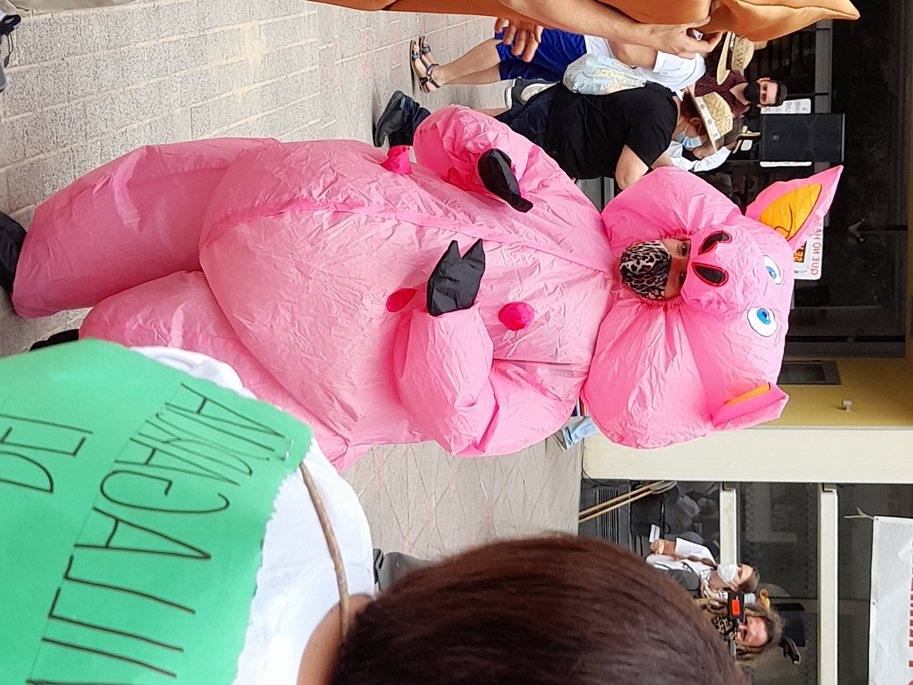

# **Welcome!**

This is a website accompanying the MA thesis "Fighting for our Lives". The primarily goal of this website is 
to create a place to document the data manipulation needed to produce my quantitative analysis. As such, this
webpage is intended to add transparency to my thesis and make my research reproducible.

## How can you use this website?

1. This webpage is organized on several tabs. You can click on each of them depending on what you would like
to explore.

2. The code contained in this website is explained to the reader assuming that he/she does not have any prior
experience coding on R. You can find explanations in the text introducing each chunk of code and next to
lines of code (introduced by a "#"). Sometimes, I decided to choose verbose code that can be easily 
understood my humans over "elegant" code. This decision was made in the spirit of making my research
understandable to as many people as possible.

# Acknowledgement

At this point, this website is based on the code generously shared by doctor Matthew Crump. At a later 
stage in the project, I plan to create my own code for this website. But it would be unfair not to credit
doctor Crump. You can find his github on the following [here](https://github.com/CrumpLab).

